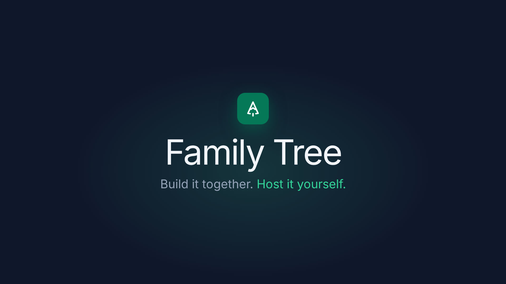

# Family Tree

[](https://github.com/chandanshakya/family-tree/actions/workflows/tests.yml)
[](https://github.com/chandanshakya/family-tree/actions/workflows/lint.yml)
[](LICENSE)

<p align="center">
  <a href="docs/media/demo.mp4"></a>
  <br><sub>▶ <a href="docs/media/demo.mp4">Watch the 20-second tour</a></sub>
</p>

Self-hosted, collaborative genealogy. Build a family tree together with relatives, keep every change in history, and stay in control of your data. It runs on a Raspberry Pi 4 or a small VPS behind a Cloudflare Tunnel, with SQLite as the only database.

## Features

- **Trees and people:** first, middle, last and maiden names, gender, birth and death dates in **AD or Bikram Sambat (BS)**, places, biography, events and photos.
- **Relationships:** parents, spouses, siblings and guardians. Grandparents, cousins and in-laws are derived, and "How are we related?" names the relation and shows the path.
- **Tree view:** zoom and pan, top-down or left-to-right layout, and a focus mode for large trees (tested up to 50 000 people).
- **Collaboration:** family and direct join codes, owner/editor/contributor/viewer roles, profile claims (with verification questions or owner review), notifications, and a full change history with one-click revert and undo.
- **Search:** full-text search (Latin and Devanagari), typo-tolerant fuzzy search, filters by birth year and place, a duplicate finder and a surname explorer.
- **Privacy:** private by default. Public trees and member exports hide living people. Photos are never cacheable by shared caches.
- **Import and export:** GEDCOM 5.5.1, JSON and CSV, plus tree backups and instance backup/restore scripts.
- **Accounts:** email and password, optional Google sign-in, email verification and password reset over SMTP.
- **Installable:** works as a PWA with an offline fallback page, in light and dark themes, on phones and desktops.

## Quick start

### Docker (production)

```bash
git clone https://github.com/chandanshakya/family-tree.git
cd family-tree
cp .env.example .env            # fill in ORIGIN, secrets, tunnel token, SMTP
docker compose up -d --build
```

The app is reachable only through Cloudflare Tunnel. See [docs/deployment.md](docs/deployment.md) for the full guide, including Raspberry Pi tuning, Cloudflare settings and backups.

### Local development

Requires Node 22 or newer.

```bash
npm ci
npm run dev                     # http://localhost:5173, creates ./data/family.db
```

## Documentation

| Guide | |
|---|---|
| [Installation](docs/installation.md) | Local and Docker setup |
| [Configuration](docs/configuration.md) | Every environment variable |
| [Usage](docs/usage.md) | Trees, people, invitations, claims, privacy |
| [Architecture](docs/architecture.md) | How it is built |
| [Deployment](docs/deployment.md) | Docker, Cloudflare Tunnel, Raspberry Pi, backups |
| [Troubleshooting](docs/troubleshooting.md) | Common problems |
| [FAQ](docs/faq.md) | Questions people ask |

The design record (specification, decisions, audit, benchmarks) lives in [docs/project](docs/project).

## Tech stack

SvelteKit 2 with Svelte 5, Node 22 (adapter-node), SQLite (better-sqlite3 and Drizzle ORM), Tailwind CSS 4 with shadcn-svelte, d3-zoom, sharp, Vitest and Playwright.

## Contributing

Contributions are welcome. Please read [CONTRIBUTING.md](CONTRIBUTING.md) and the [Code of Conduct](CODE_OF_CONDUCT.md). Report security issues privately as described in [SECURITY.md](SECURITY.md).

## License

[MIT](LICENSE) © Chandan Shakya
